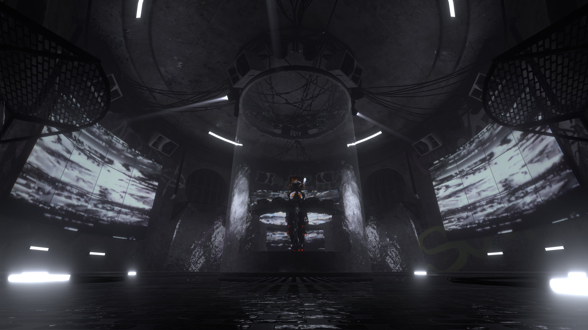

# Centrifuge
Centrifuge is our "theatre in the round" style venue, designed to benifit from the centre staging. It is ideal for smaller DJ sets due to the intimate atmosphere created by the circular design. It also features 4 dance platforms surrounding the entire main area, allowing for the dancers to get close to the Audience.

## Venue Details

| Feature          | Details                                                                                                   |
| :--------------- | :-------------------------------------------------------------------------------------------------------- |
| Capacity         | 80                                                                                                        |
| Audio            | Distance based Stereo / Constant Volume                                                                   |
| Screens          | 3 Screens on the walls                                                                                    |
| Dancer Platforms | 4 Surrounding the main area                                                                               |
| Dynamic Lighting | Arealit Wall Audiolink Lighting / Arealit Floor Audiolink Lighting / Noriben Spot Audiolink StageLighting |
| Special Features | UV switcher (Split/Mirror)                                                                                |
| DMX Lighting     | None                                                                                                      |

| head1        | head two          | three |
| :----------- | :---------------- | :---- |
| ok           | good swedish fish | nice  |
| out of stock | good and plenty   | nice  |
| ok           | good `oreos`      | hmm   |
| ok           | good `zoute` drop | yumm  |
