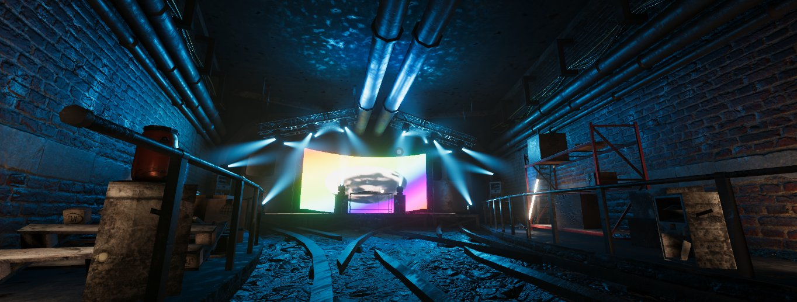

# Junktion
SONAR's newest venue, Junktion, is a small underground rail crossing of two subway lines. The venue features a gritty, industrial aesthetic fit for underground 2000s era raves.

## Venue Details

| Feature          | Details                                                          |
| :--------------- | :--------------------------------------------------------------- |
| Capacity         | 80                                                               |
| Audio            | Spatialised Stereo  Distance based Stereo  Constant Volume |
| Screens          | One screen located behind the DJ                                 |
| Dancer Platforms | Dance platforms on either side of the DJ                         |
| Dynamic Lighting | Arealit Screen  VRSLGI Spotlight Movers                       |
| Special Features | None (Maybe there are some fun gobo patterns `¯\_(ツ)_/¯`)       |
| DMX Lighting     | YES (See DMX Patch Below)                                        |

## VRSL DMX Patch

| Fixture ID | DMX Address | Fixture Type     | Location         |
| :--------- | :---------- | :--------------- | :--------------- |
| 1001       | 1.1         | 13 Channel Mover | Stage Far Left   |
| 1002       | 1.14        | 13 Channel Mover | Stage Near Left  |
| 1003       | 1.27        | 13 Channel Mover | Stage DJ Left    |
| 1004       | 1.40        | 13 Channel Mover | Stage DJ Right   |
| 1005       | 1.53        | 13 Channel Mover | Stage Near Right |
| 1006       | 1.66        | 13 Channel Mover | Stage Far Right  |
| 1101       | 1.79        | 13 Channel Mover | Ceiling Truss 1  |
| 1102       | 1.92        | 13 Channel Mover | Ceiling Truss 1  |
| 1103       | 1.105       | 13 Channel Mover | Ceiling Truss 1  |
| 1104       | 1.118       | 13 Channel Mover | Ceiling Truss 1  |
| 1105       | 1.131       | 13 Channel Mover | Ceiling Truss 1  |
| 1106       | 1.144       | 13 Channel Mover | Ceiling Truss 1  |
| 1201       | 1.157       | 13 Channel Mover | Ceiling Truss 2  |
| 1202       | 1.170       | 13 Channel Mover | Ceiling Truss 2  |
| 1203       | 1.183       | 13 Channel Mover | Ceiling Truss 2  |
| 1204       | 1.196       | 13 Channel Mover | Ceiling Truss 2  |
| 1205       | 1.209       | 13 Channel Mover | Ceiling Truss 2  |
| 1206       | 1.222       | 13 Channel Mover | Ceiling Truss 2  |