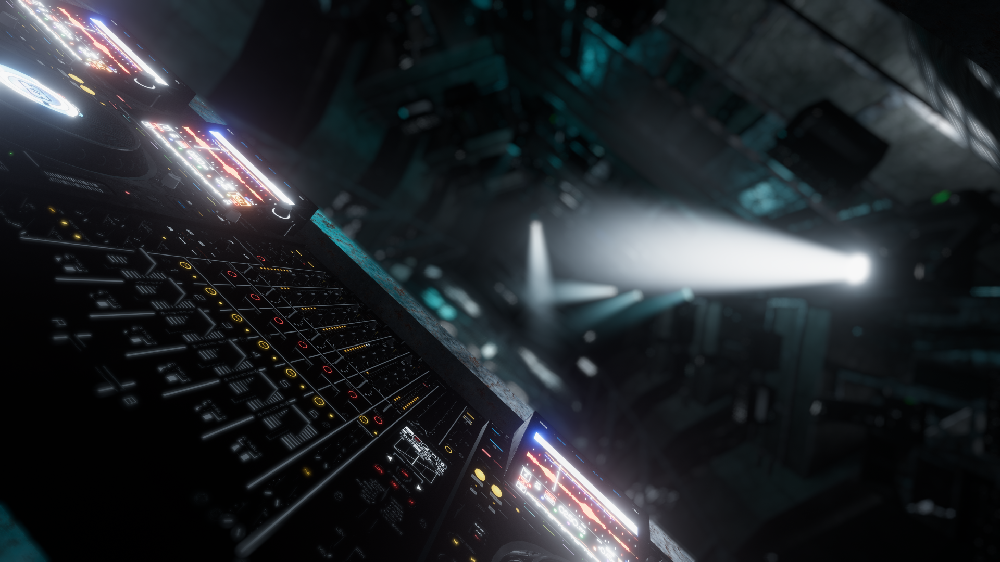

# KickLab
SONAR's Kicklab is our resident venue for all things heavy and hard-hitting. Designed to deliver an immersive Visual and Light experience, Kicklab is the perfect setting for bass-heavy music genres.

## Venue Details
| Feature          | Details                                                                                               |
|: ---------------- |: ----------------------------------------------------------------------------------------------------- |
| Capacity         | 80                                                                                                    |
| Audio            | - Spatialised Stereo  - Distance based Stereo  - Constant Volume                                |
| Screens          | 3 screens on the roof                                                                                 |
| Dancer Platforms | Dance platforms on either side of the DJ Booth                                                        |
| Dynamic Lighting | - Arealit Screen  - VRSLGI Spotlight Movers, Blinders & LEDS  - OwenTheProgrammer Latrix Lasers |
| Special Features | Heavy genres focused                                                                                  |
| DMX Lighting     | YES (See DMX Patch Below)                                                                             |

## VRSL DMX Patch
| Fixture ID | DMX Address | Fixture Type | Location      |
| ---------- | ----------- | ------------ | ------------- |
| 1001       | 1.1         | 13Ch Mover   | Ceiling Truss |
| 1002       | 1.14        | 13Ch Mover   | Ceiling Truss |
| 1003       | 1.27        | 13Ch Mover   | Ceiling Truss |
| 1004       | 1.40        | 13Ch Mover   | Ceiling Truss |
| 1005       | 1.53        | 13Ch Mover   | Ceiling Truss |
| 1006       | 1.66        | 13Ch Mover   | Ceiling Truss |
| 1007       | 1.79        | 13Ch Mover   | Ceiling Truss |
| 1008       | 1.92        | 13Ch Mover   | Ceiling Truss |
| 1101       | 1.105       | 13Ch Mover   | Side Truss    |
| 1102       | 1.118       | 13Ch Mover   | Side Truss    |
| 1103       | 1.131       | 13Ch Mover   | Side Truss    |
| 1104       | 1.144       | 13Ch Mover   | Side Truss    |
| 1105       | 1.157       | 13Ch Mover   | Side Truss    |
| 1106       | 1.170       | 13Ch Mover   | Side Truss    |
| 2001       | 1.183       | 5Ch LED      | Ceiling Truss |
| 2002       | 1.188       | 5Ch LED      | Ceiling Truss |
| 2003       | 1.193       | 5Ch LED      | Ceiling Truss |
| 2004       | 1.198       | 5Ch LED      | Ceiling Truss |
| 2005       | 1.203       | 5Ch LED      | Ceiling Truss |
| 2006       | 1.208       | 5Ch LED      | Ceiling Truss |
| 2007       | 1.213       | 5Ch LED      | Ceiling Truss |
| 2008       | 1.218       | 5Ch LED      | Ceiling Truss |
| 2101       | 1.223       | 5Ch LED      | Side Truss    |
| 2102       | 1.228       | 5Ch LED      | Side Truss    |
| 2103       | 1.233       | 5Ch LED      | Side Truss    |
| 2104       | 1.238       | 5Ch LED      | Side Truss    |
| 2105       | 1.243       | 5Ch LED      | Side Truss    |
| 2106       | 1.248       | 5Ch LED      | Side Truss    |
| 2107       | 1.253       | 5Ch LED      | Side Truss    |
| 2108       | 1.258       | 5Ch LED      | Side Truss    |
| 2201       | 1.263       | 5Ch LED      | Side Truss    |
| 2202       | 1.268       | 5Ch LED      | Side Truss    |
| 2203       | 1.273       | 5Ch LED      | Side Truss    |
| 2204       | 1.278       | 5Ch LED      | Side Truss    |
| 2205       | 1.283       | 5Ch LED      | Side Truss    |
| 2206       | 1.288       | 5Ch LED      | Side Truss    |
| 2207       | 1.293       | 5Ch LED      | Side Truss    |
| 2208       | 1.298       | 5Ch LED      | Side Truss    |
| 3001       | 1.303       | 5Ch Blinder  | Booth Roof    |
| 3002       | 1.308       | 5Ch Blinder  | Booth Roof    |
| 9001       | 1.313       | 1Ch Pyro     | Booth         |
| 9002       | 1.314       | 1Ch Pyro     | Booth         |