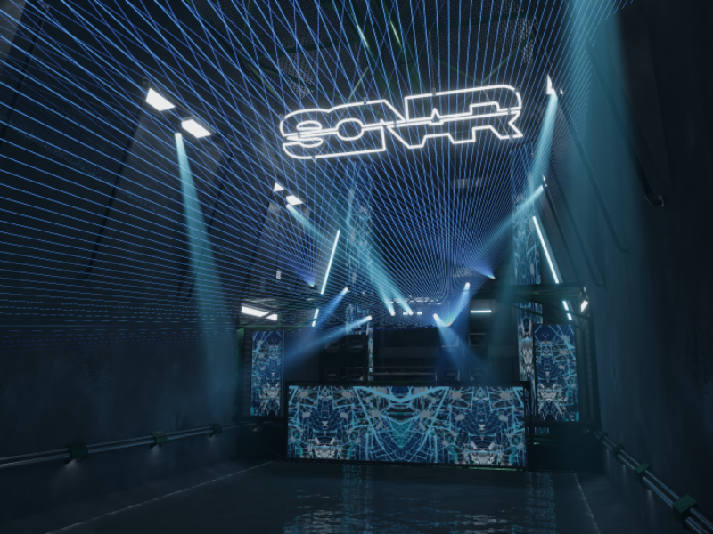

# Spillways
The Spillways is SONAR's festival venue, designed to host large-scale events and performances, this venues unique architecture and tall ceilings creates a sense of scale and grandeur.

## Venue Details

| Feature          | Details                                                                                       |
| :--------------- | :-------------------------------------------------------------------------------------------- |
| Capacity         | 80                                                                                            |
| Audio            | Distance based Stereo  Constant Volume                                                     |
| Screens          | Multiple Screens on the platform with 2 tall screens at the back                              |
| Dancer Platforms | Dance Catwalk above the stage                                                                 |
| Dynamic Lighting | Arealit Wall Audiolink Lighting  Noriben Spotlights Audiolink  Noriben Lasers Audiolink |
| Special Features | Slide at the beginning of the venue (weeee...)                                                |
| DMX Lighting     | None                                                                                          |