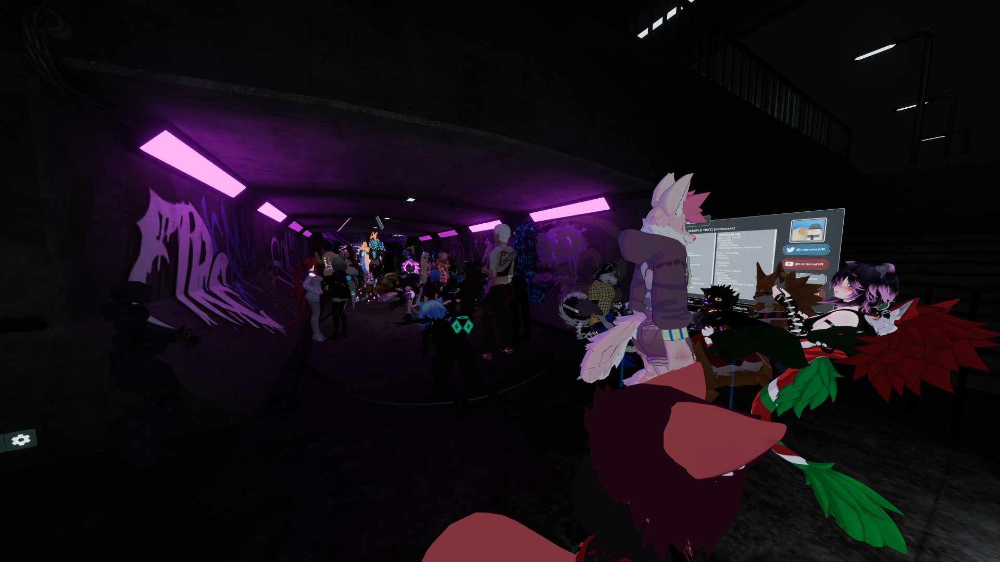

# Underpass
Underpass is SONAR's primary world and home to many of our events. Typically used for "Open Decks" events, Underpass features a single long tunnel with the DJ at the end. It features graffiti-covered walls, wall and floor lighting that react to the music.

## Venue Details

| Feature          | Details                                                   |
| :--------------- | :-------------------------------------------------------- |
| Capacity         | 80                                                        |
| Audio            | Spatialized  Distance-based Stereo  Constant Volume |
| Screens          | 1x Screen Behind DJ Booth                                 |
| Dancer Platforms | None                                                      |
| Dynamic Lighting | Arealit Ceiling Lights  Arealit Floor Light Tubes      |
| Special Features | Manual Color Picker for Floor and Wall Lights             |
| DMX Lighting     | None                                                      |